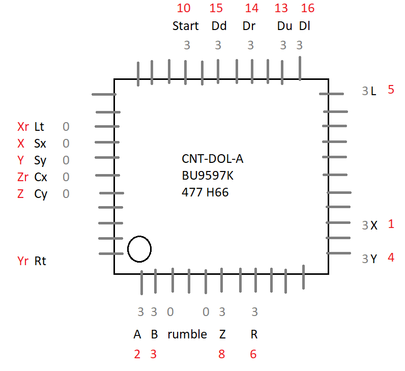

# Bongos

Spec | Details
--- | ---
Voltage | 5V, 3.43V
Pullup | 1kOhm
Protocol | [Joybus](./Joybus)

## Pinout

Soon&trade;

## References

1. <http://hitmen.c02.at/files/yagcd/yagcd/chap9.html#sec9>
